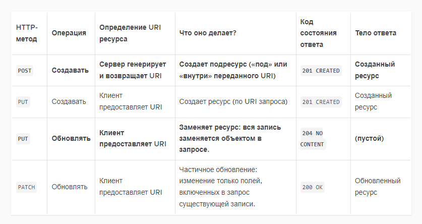

# Проект для изучения java spring boot.

## Сам проект представляет из себя создания web приложения для отслеживания финансов. _Ориентировано для семей._

В этом проекте будет применяться метод разработки через тестирование (TDD). Зачем применять TDD?
Утверждая ожидаемое поведение до реализации желаемой функциональности, мы проектируем систему на основе того, что мы
хотим, чтобы она делала, а не на том, что система уже делает.

### О тестах

Различные тесты могут быть написаны на разных уровнях системы. На каждом уровне существует баланс между скоростью
выполнения, «стоимостью» поддержки теста и уверенностью в правильности системы, которую он приносит. Эту иерархию часто
представляют как «пирамиду тестирования».

1 - основание пирамды

1. **Модульные тесты(Unit test)**
   Модульные тесты тестируют небольшую «единицу» системы, изолированную от остальной системы. Они должны быть простыми и
   быстрыми. Вам нужен высокий процент модульных тестов в вашей пирамиде тестирования, поскольку они являются ключом к
   разработке высокосвязного, слабосвязанного программного обеспечения.
2. **Интеграционные тесты(Integration Tests)**
   Интеграционные тесты проверяют подмножество системы и могут проверять группы модулей в одном тесте. Их сложнее писать
   и поддерживать, и они выполняются медленнее, чем модульные тесты.
3. **Сквозные тесты(End-to-End Tests)**
   Сквозные тесты проверяют систему, используя тот же интерфейс, что и пользователь, например веб-браузер. Несмотря на
   то, что сквозные тесты чрезвычайно тщательны, они могут быть очень медленными и нестабильными, поскольку они
   используют симуляцию взаимодействия с пользователем в потенциально сложных пользовательских интерфейсах. Реализуйте
   наименьшее количество этих тестов.

### Красный, зеленый, цикл рефакторинга

Один из единственных способов безопасного рефакторинга — это наличие надежного набора тестов. Таким образом, лучшее
время для рефакторинга кода, на котором вы сейчас сосредоточены, — это цикл TDD. Это называется циклом разработки Red,
Green, Refactor:
1. Красный: напишите неудачный тест для желаемой функциональности.
2. Зеленый: Реализуйте самое простое, что может помочь пройти тест.
3. Рефакторинг: ищите возможности упростить, уменьшить дублирование или иным образом улучшить код без изменения какого-либо поведения — провести рефакторинг.
4. Повторить!

О URI - это является более обобщённый класс чем URL, поэтому предпочтительнее исопльзовать его.

# **О безопасности**

## Аутентификация

Пользователем API на самом деле может быть человек или другая программа, поэтому часто мы будем использовать термин « Принципал» как синоним слова «пользователь».
Аутентификация — это действие Принципала, подтверждающее его личность системе.
Один из способов сделать это — предоставить учетные данные (например, имя пользователя и пароль с использованием базовой аутентификации ).
Мы говорим, что после предоставления надлежащих учетных данных Принципал аутентифицируется или, другими словами, пользователь успешно вошел в систему.

HTTP — это протокол без отслеживания состояния, поэтому каждый запрос должен содержать данные, подтверждающие, что он поступил от проверенного принципала.
Хотя можно предоставлять учетные данные при каждом запросе, это неэффективно, поскольку требует дополнительной обработки на сервере.
Вместо этого сеанс аутентификации (или сеанс аутентификации, или просто сеанс) создается, когда пользователь проходит аутентификацию.
Сессии могут быть реализованы разными способами. Мы будем использовать общий механизм: токен сеанса (строка случайных символов), который генерируется и помещается в файл cookie.
Файл cookie — это набор данных, хранящихся в веб-клиенте (например, браузере) и связанных с определенным URI.

Несколько приятных особенностей файлов cookie:

Файлы cookie автоматически отправляются на сервер при каждом запросе (для этого не нужно писать дополнительный код).
Пока сервер проверяет действительность токена в файле cookie, неаутентифицированные запросы могут быть отклонены.
Файлы cookie могут сохраняться в течение определенного периода времени, даже если веб-страница закрыта, а затем повторно посещена.
Эта возможность обычно улучшает взаимодействие с пользователем веб-сайта.

## Spring безопасность и аутентификация

Spring Security реализует аутентификацию в Filter Chain.
Цепочка фильтров — это компонент веб-архитектуры Java, который позволяет программистам определять последовательность методов, которые вызываются до контроллера.
Каждый фильтр в цепочке решает, разрешить ли продолжить обработку запроса или нет.
Spring Security вставляет фильтр, который проверяет аутентификацию пользователя и возвращает ответ, 401 UNAUTHORIZED если запрос не аутентифицирован.

## Авторизация

До сих пор мы обсуждали аутентификацию. Но на самом деле аутентификация — это только первый шаг.
Авторизация происходит после аутентификации и позволяет разным пользователям одной системы иметь разные разрешения.

Spring Security обеспечивает авторизацию через управление доступом на основе ролей (RBAC).
Это означает, что Принципал имеет несколько Ролей. Каждый ресурс (или операция) определяет, какие роли должен иметь Принципал, чтобы выполнять действия с надлежащими полномочиями.
Например, пользователю с ролью администратора, скорее всего, будет разрешено выполнять больше действий, чем пользователю с ролью владельца карты.
Вы можете настроить авторизацию на основе ролей как на глобальном уровне, так и для каждого метода.

## Та же политика происхождения

Интернет — опасное место, где злоумышленники постоянно пытаются воспользоваться уязвимостями безопасности.
Самый базовый механизм защиты основан на HTTP-клиентах и серверах, реализующих политику одинакового происхождения (SOP).
Эта политика гласит, что только скрипты, содержащиеся на веб-странице, могут отправлять запросы к источнику (URI) веб-страницы.

СОП имеет решающее значение для безопасности веб-сайтов, поскольку без этой политики любой может написать веб-страницу, содержащую сценарий, который отправляет запросы на любой другой сайт.
Например, давайте посмотрим на типичный банковский веб-сайт. Если пользователь вошел в свой банковский счет и посещает вредоносную веб-страницу (в другой вкладке или окне браузера),
вредоносные запросы могут быть отправлены (с помощью файлов cookie аутентификации) на сайт банка.
Это может привести к нежелательным действиям, например снятию средств с банковского счета пользователя!

Совместное использование ресурсов между источниками
Иногда система состоит из сервисов, работающих на нескольких машинах с разными URI (т. е. микросервисов).
Совместное использование ресурсов между источниками (CORS) — это способ взаимодействия браузеров и серверов для смягчения SOP.
Сервер может явно разрешить список «разрешенных источников» запросов, поступающих из источника, находящегося за пределами сервера.

Spring Security предоставляет @CrossOrigin аннотацию, позволяющую указать список разрешенных сайтов.
Будь осторожен! Если вы используете аннотацию без каких-либо аргументов, она разрешит все источники, так что имейте это в виду!

## О распространнёных вредоносных веб-эксплойтах

### Подделка межсайтового запроса

Одним из типов уязвимостей является подделка межсайтовых запросов (CSRF) , которую часто называют «Sea-Surf» , а также известная как Session Riding.
Сеансовая езда фактически активируется с помощью файлов cookie. CSRF-атаки происходят, когда вредоносный фрагмент кода отправляет запрос на сервер, на котором проходит аутентификация пользователя.
Когда сервер получает файл cookie аутентификации, он не может узнать, отправила ли жертва вредоносный запрос непреднамеренно.

Для защиты от атак CSRF вы можете использовать токен CSRF.
Токен CSRF отличается от токена аутентификации, поскольку при каждом запросе генерируется уникальный токен.
Это затрудняет вмешательство внешнего субъекта в «разговор» между клиентом и сервером.

К счастью, Spring Security имеет встроенную поддержку токенов CSRF, которая включена по умолчанию.

### Межсайтовый скриптинг

Возможно, даже более опасной, чем уязвимость CSRF, является межсайтовый скриптинг (XSS).
Это происходит, когда злоумышленнику каким-то образом удается «обмануть» приложение-жертву, заставив его выполнить произвольный код.
Есть много способов сделать это. Простой пример — сохранение строки в базе данных, содержащей <script>тег, а затем ожидание, пока строка не будет отображена на веб-странице, что приведет к выполнению сценария.

XSS потенциально более опасен, чем CSRF.
В CSRF могут выполняться только те действия, на которые пользователь имеет право. Однако в XSS произвольный вредоносный код выполняется на клиенте или на сервере.
Кроме того, XSS-атаки не зависят от аутентификации. Скорее, XSS-атаки зависят от «дыр» в безопасности, вызванных плохой практикой программирования.

Основным способом защиты от XSS-атак является правильная обработка всех данных из внешних источников (например, веб-форм и строк запросов URI).
В случае нашего <script>примера с тегом атаки можно смягчить, правильно экранируя специальные символы HTML при отображении строки.

## О CSRF

Для целей нашего Family Cash Card API мы собираемся следовать рекомендациям команды Spring Security в отношении клиентов, [не использующих браузер:](https://docs.spring.io/spring-security/site/docs/5.0.x/reference/html/csrf.html#when-to-use-csrf-protection)

Когда вам следует использовать защиту CSRF? 
Наша рекомендация заключается в использовании защиты CSRF для любого запроса, который может быть обработан браузером обычными пользователями. 
Если вы создаете только службу, используемую клиентами, не являющимися пользователями браузера, вы, скорее всего, захотите отключить защиту CSRF.

Если вы хотите добавить защиту CSRF в наше приложение, пожалуйста, ознакомьтесь с опциями поддержки тестирования, приведенными ниже.

[Примеры тестирования CSRF MockMvc](https://docs.spring.io/spring-security/reference/servlet/test/mockmvc/csrf.html)
[Примеры тестирования CSRF веб-тестового клиента.](https://docs.spring.io/spring-security/site/docs/5.2.0.RELEASE/reference/html/test-webflux.html#csrf-support)
Описание шаблона [двойной отправки файлов cookie.](https://cheatsheetseries.owasp.org/cheatsheets/Cross-Site_Request_Forgery_Prevention_Cheat_Sheet.html#double-submit-cookie)

Сводка по операциям POST, PUT, PATCH и CRUD

В API Cash Card нам не нужно разрешать PUTсоздание ресурсов. Нам также не нужно добавлять данные на стороне сервера для операции обновления и не нужно разрешать частичное обновление. Итак, наша PUTконечная точка ограничена третьей строкой приведенной выше таблицы.

Строки , выделенные жирным шрифтом в приведенной выше таблице, реализованы API Cash Card. Нежирные — нет.